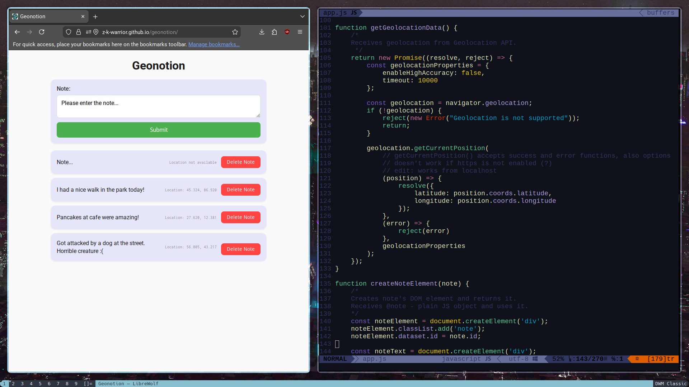

# Geonotion
PWA веб-приложение для составления текстовых заметок со встроенной геолокацией.

## Демонстрация и Скриншоты

<video src="https://github.com/user-attachments/assets/a75b9322-9165-4c8f-8498-b751e04c41bf" 
       controls width="100%"></video>

## Возможности

- Создание, просмотр и удаление заметок
- Автоматическое определение геолокации (с разрешения пользователя)
- Работа без интернета (кэширование через Service Worker)
- Установка на как PWA (Progressive Web App)

## Технологии

- HTML5 / CSS3
- JavaScript (async/await)
- IndexedDB (хранение данных)
- Geolocation API
- Service Workers (PWA)

## Установка
Для установки необходимо клонировать репозиторий, а затем выполнить хостинг файлов через защищенный контекст (HTTPS), т.к. API геолокации и ServiceWorker работает только в нем. 

Наиболее простые варианты:
- Запуск через Visual Studio Code Liveserver на localhost | 127.0.0.1
- Готовая демонстрация есть по ссылке: https://z-k-warrior.github.io/geonotion/